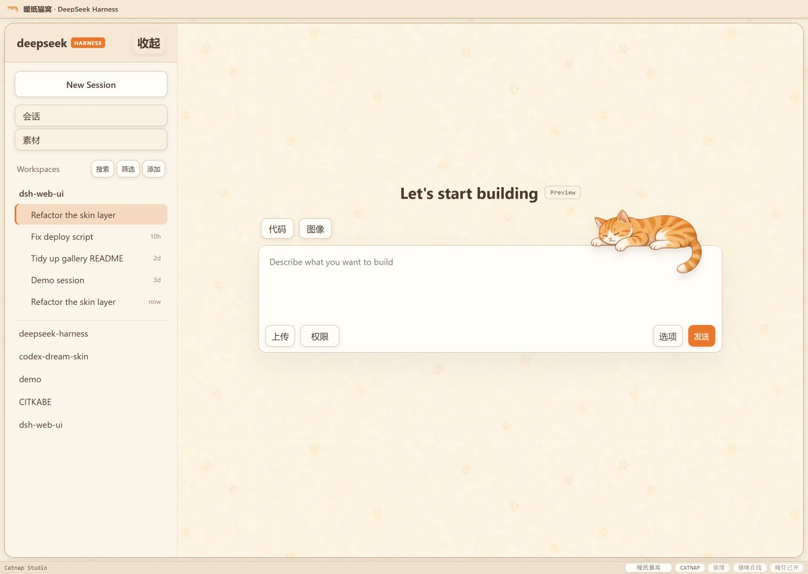
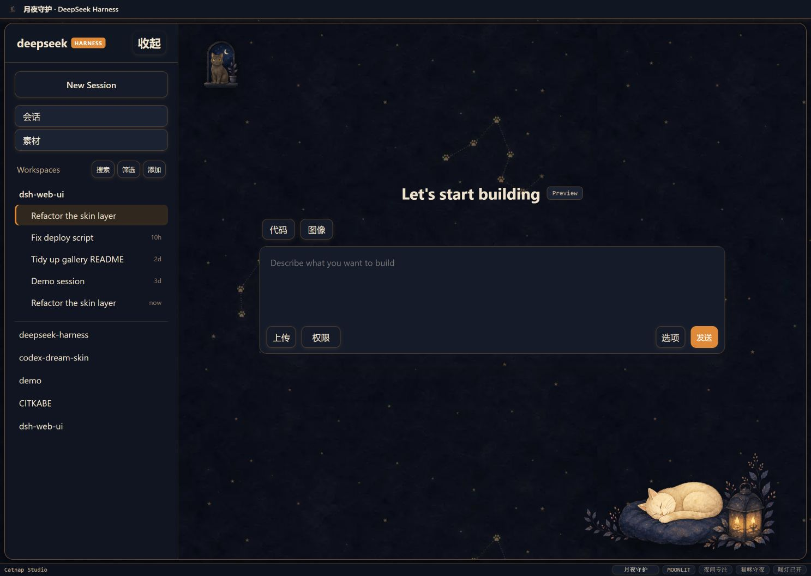
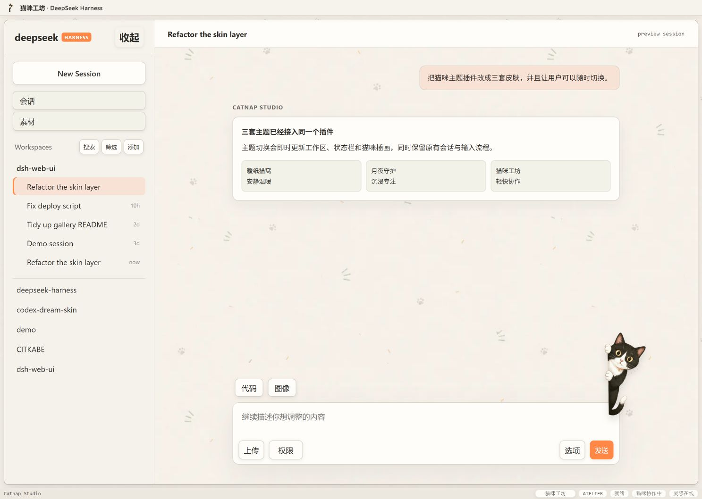

# 猫咪主题工坊 · Catnap Studio

中文 | [English](README.en.md)

面向 DeepSeek Harness Web UI 的猫咪工作台插件。它保留成熟 DSH Web UI 的任务、仓库、文件、统计与设置能力，再用一套原创猫咪视觉层统一界面；一个安装包内置三套完整外观和一只可互动的桌面猫咪。

| 暖纸猫窝 | 月夜守护 | 猫咪工坊 |
| --- | --- | --- |
|  |  |  |

## 三套主题

- **暖纸猫窝**：奶油纸张、杏橙控件和趴在输入框旁的橘猫。
- **月夜守护**：深靛夜色、金色星点、守夜黑猫和提灯睡猫。
- **猫咪工坊**：再生纸、蓝红标记、协作便笺和探头的奶牛猫。

所有猫咪插画与纸张纹理均打包进浏览器 bundle，插件运行时不会请求外部图片。主题本身不触及模型请求。

## 完整工作台能力

- **设置内主题切换**：在「设置 → 通用设置 → 外观」里使用三张大卡片切换主题；设置打开时桌面猫咪会自动收起，关闭后恢复。
- **猫窝中心**：管理猫咪伙伴并查看已启用能力。
- **猫咪伙伴**：支持拖动位置、摸猫、喂小鱼干、改名、隐藏/召回；好感度和位置保存在浏览器本地。
- **任务看板**：按状态组织任务、打开详情并支持定时执行。
- **Git 图谱**：切换分支、查看提交历史与仓库状态。
- **文件与预览**：在右侧面板浏览、预览和管理工作区文件。
- **实时统计**：查看 TPS、上下文、缓存和令牌用量。
- **插件设置**：在 DSH 设置中心统一管理工作台功能。

后五项能力由 `@linxin666/dsh-web-ui` 系列公开包的 `0.1.12` 编译代码组合而成；Catnap Studio 不复制原项目的人物或背景素材。第三方声明及双重许可证说明见 [THIRD_PARTY_NOTICES.md](THIRD_PARTY_NOTICES.md)。

## 环境要求

- Node.js `^22.19.0` 或 `>=24`
- pnpm `11.21.0`
- DeepSeek Harness Web UI

如果 PowerShell 提示“无法将 `dsh` 识别为 cmdlet”，先安装 CLI，再重开一个 PowerShell 窗口：

```powershell
npm.cmd install -g @deepseek-ai/dsh
dsh --version
```

## 从源码安装

```sh
git clone https://github.com/luoyan96/dsh-catnap-studio.git
cd dsh-catnap-studio
pnpm install
pnpm run ci
dsh plugin --profile web add link:$(pwd)
dsh web
```

Windows PowerShell 可将最后两步改为：

```powershell
dsh plugin --profile web add "link:$($PWD.Path)"
dsh web
```

安装或升级后需要重启 `dsh web`。卸载：

```sh
dsh plugin --profile web remove dsh-client-ui-skin-catnap
```

如果之前装过整合包，建议先移除它，避免同一批功能插件被重复注册：

```powershell
dsh plugin --profile web remove @linxin666/dsh-web-ui-all
```

## 使用 Release 安装包

推送形如 `v0.3.0` 的 Git 标签后，仓库的 Release 工作流会自动运行验证并上传 `dsh-client-ui-skin-catnap-0.3.0.tgz`。下载后可将本地包路径传给 `dsh plugin --profile web add`。

## 开发

```sh
pnpm install
pnpm run typecheck
pnpm test
pnpm run build
pnpm run pack:check
```

打开本地预览：

```sh
python -m http.server 4173
```

然后访问 `http://127.0.0.1:4173/preview/index.html?theme=warm`。查询参数 `theme` 支持 `warm`、`moonlit`、`atelier`；猫咪工坊的活跃会话示例可追加 `&state=active`。

## 仓库结构

```text
.github/workflows/   持续集成与标签发布
design/              参考稿、可复现素材母版和运行时图片
design-qa/           同尺寸视觉对照证据
preview/             可直接打开的主题预览与仓库截图
scripts/             素材压缩、嵌入和视觉对照脚本
src/                 DSH 插件源码
tests/               生命周期与主题切换测试
```

主题和组件约束见 [DESIGN.md](DESIGN.md)，视觉验收记录见 [design-qa.md](design-qa.md)，参与开发见 [CONTRIBUTING.md](CONTRIBUTING.md)。

## 许可证

Catnap Studio 自有代码与素材采用 [BSD-3-Clause](LICENSE)。内嵌 UI 模块的 npm 清单声明 Apache-2.0，其 tarball 同时携带 BSD-3-Clause 文本；本仓库保留两者，详见 [THIRD_PARTY_NOTICES.md](THIRD_PARTY_NOTICES.md)。
